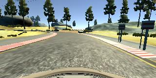

# **Behavioral Cloning with Deep Neural Networks**


In thie project I create a Deep Learning based autonomous control system that can drive a  car around a simulated track. 


## Goals

The goals / steps of this project are the following:
* Use the simulator to collect data of good driving behavior
* Build, a convolution neural network in Keras that predicts steering angles from images
* Train and validate the model with a training and validation set
* Test that the model successfully drives around track one without leaving the road
* Iterate on the network and the data to make a better driving car.

## Code
https://github.com/railsnoob/Behavioral-Cloning-Using-DNN

## Movie (grainy) Of The Neural Network driving the car simulator on its own 
The *MOVIE* (mp4) of a Deep Neural Network driving a car (in the simulator) on its own - in case you can't wait : https://github.com/railsnoob/Behavioral-Cloning-Using-DNN/blob/master/run1.mp4?raw=true

The simulator movie is grainy because we wanted to run it at the highest frames per second.


## Model Architecture and DNN Training Strategy

### 1. Design Approach

The overall strategy for deriving a model architecture was to:
1. **Create a base learning network** similar to others (AlexNet, DriveNet, SqueezeDet) which have been used to regress the driving angle so as to control a car
2. **Add dropout and scaling** to help reduce overfitting and issues related with parameter values
2. **Augmented data samples** by driving in both directions and adding samples where the car corrects from the side of the road to the center. This was probably the biggest factor in getting a good driving model. 
3. **Prune superfluous elements** from the input (eg: trees etc)

My first step was to start with a convolution neural network model similar to LeNet because it also output a single element (though LeNet is discrete whereas our system is not) and in a real world network the smallest network would be at an advantage because of processing constraints on the car. The only difference being that we have to output a continuous variable instead of a discrete one. To do that I used the Mean Sqaured Error.

In order to gauge how well the model was working, I split my image and steering angle data into a training and validation set. I found that my first model had a low mean squared error on the training set but a high mean squared error on the validation set. This implied that the model was overfitting. 

**To combat overfitting, I modified the model** by doing the following:
1. I added dropout between convolutional layers
2. Scaled the features 
3. Increased the amount of data to process

The final step was to run the simulator to see how well the car was driving around track one. There were a few spots where the vehicle fell off the track and to improve the driving behavior in these cases, I drove the car in both directions and I added instsances where the car drives from the side of the track to the center. 

At the end of the process, the vehicle is able to drive autonomously around the track without leaving the road.


### 2. Model Architecture

My model consists of a convolution neural network with 5x5 filter sizes. I added dropout to minimize the error. 

The model includes RELU layers to introduce nonlinearity (code line 66), and the data is normalized in the model using a Keras lambda layer (code line 64).

https://github.com/railsnoob/Behavioral-Cloning-Using-DNN/blob/master/model.py#L63

The final model architecture (model.py lines 18-24) consisted of a convolution neural network with the following layers and layer sizes:
https://github.com/railsnoob/Behavioral-Cloning-Using-DNN/blob/master/model.py#L63

~~~~

model = Sequential()
model.add(Lambda(lambda x: x/255.0-0.5,input_shape=(160,320,3)))
model.add(Cropping2D(cropping=((70,25),(0,0))))
model.add(Convolution2D(6,5,5,activation='relu'))
model.add(MaxPooling2D())
model.add(Dropout(0.2))
model.add(MaxPooling2D())
model.add(Dropout(0.2))
model.add(Flatten())
model.add(Dense(120))
model.add(Dense(84))
model.add(Dense(1))

~~~~


[//]: # (Image References)


[image2]: ./center_driving_middle.jpg "Center Driving"
[image3]: ./center_driving_from_left.jpg "Recovery Image 1 left"
[image4]: ./center_driving_from_left_back_to_center.jpg "Recovery Image Done"

### 3. Attempts to reduce overfitting in the model

The [model contains dropout layers](https://github.com/railsnoob/Behavioral-Cloning-Using-DNN/blob/master/model.py#L68) in order to reduce overfitting (model.py lines 68). This worked much better than anticipation.
https://github.com/railsnoob/Behavioral-Cloning-Using-DNN/blob/master/model.py#L68

The model was trained and validated on different data sets to ensure that the model was not overfitting (code line 76-77). The model was tested by running it through the simulator and ensuring that the vehicle could stay on the track.

### 4. Model parameter tuning

The model used an *adam optimizer*, so the learning rate was not tuned manually (model.py line 76).

### 5. Appropriate training data (Most important factor)

Training data was chosen to keep the vehicle driving on the road. I augmented the base data set with the following:
1. center lane driving, 
2. recovering from the left and right sides of the road 
3. driving in both directions. 

For details about how I created the training data, see the next section. 

### 6. Creation of the Training Set & Training Process

To capture good driving behavior, I first recorded two laps on track one using center lane driving. Here is an example image of center lane driving:

![alt text][image2]

I then recorded the vehicle recovering from the left side and right sides of the road back to center so that the vehicle would learn to course correct when it went off the side of the road.  These images show what a recovery looks like starting from left side back to the center of the road:

![alt text][image3]
![alt text][image4]

To augment the data sat, I drove the car in the *reverse direction*. 

After the collection process, I had *9456* number of data points. I then preprocessed this data by converting the data into grayscale and scaling the image and cutting out the trees and other supefluous elements.


I finally randomly shuffled the data set and put 20% of the data into a validation set. 

I used this training data for training the model. The validation set helped determine if the model was over or under fitting. The ideal number of epochs was 3 as evidenced by the validation and test error increasing after that.  I used an adam optimizer so that manually training the learning rate wasn't necessary.

### Code Breakdown

#### 1. Structure of my system

My project includes the following files:
* model.py  - containing the script to create and train the model
* drive.py  - for driving the car in autonomous mode
* model.h5  - containing a trained convolution neural network 
* writeup.md - This document. 

#### 2. How To Run the System on Your computer
Using the  provided simulator and my drive.py file, the car can be driven autonomously around the track by executing 
```sh
python drive.py model.h5
```

#### 3. Code

The model.py file contains the code for training and saving the convolution neural network. The file shows the pipeline I used for training and validating the model, and it contains comments to explain how the code works.
